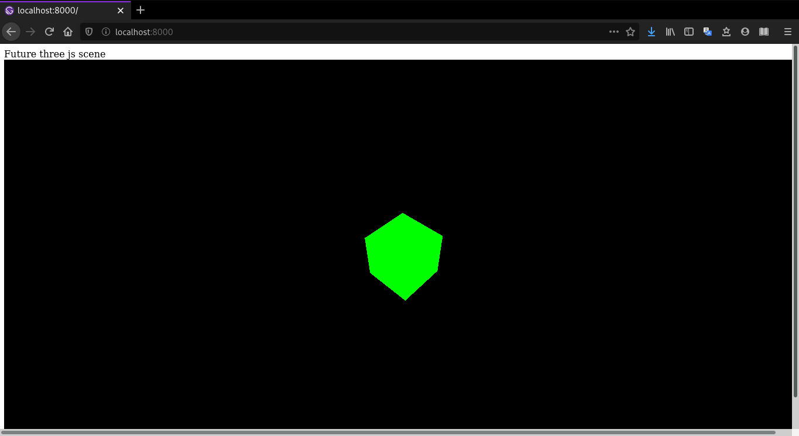
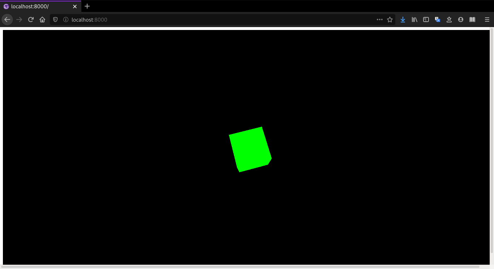
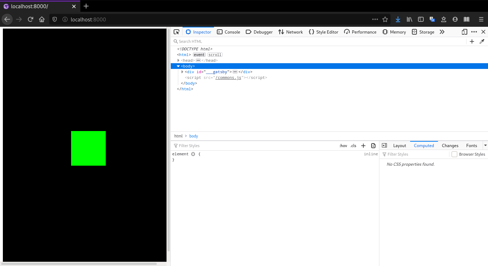

## 1. Introduction

[Three.js](https://threejs.org/) is a JavaScript library that abstracts WebGL's functionality and it's used for creating complex 3D/2D visuals in websites, which by the way was used in the hero section of this blog's homepage. Integrating it with [GatsbyJS](https://www.gatsbyjs.org/) (a framework for building React apps) is quite simple.

I would recommend using a package such as [react-three-fiber](https://github.com/react-spring/react-three-fiber) if you want a complex 3D scene with lots of user interactivity, but sometimes you don't need all this power and using pure three.js with Gatsby works just fine. This article will deal with the latter case and show you the simplest way in which you can get three.js running in a Gatsby app.

If your just interested in the final component code, skip to the [sixth section](#h2-6-updating-the-viewport-on-window-resize).

## 2. Prerequisites

This article assumes two things:

1. You already have a Gatsby development environment (if not, check their official [tutorial](https://www.gatsbyjs.org/tutorial/));
2. You know the basics of Gatsby and three.js.

## 3. New project and configuration

In the command line enter the following commands:
```bash
$ gatsby new three-website
$ cd three-app
$ npm install --save three
```

- `gatsby new three-website https://github.com/gatsbyjs/gatsby-starter-hello-world`: creates a new Gatsby project called `three-website` with a minimal project skeleton;
- `cd three-app`: **c**hanges **d**irectory to your newly create project's directory;
- `npm install --save three`: installs three.js npm package.

Now still in the command line, enter `$ gatsby develop` to launch your project in development mode and in your browser go to `http://localhost:8000` to make sure that you see Gatsby's hello world starter page:


## 4. New react component and three.js code

If you had any error at this point, make sure that you correctly installed Gatsby and its development environment. Now moving on, in a new terminal window, `cd` to your project's directory by entering the following command:

```bash
mkdir src/components
touch src/components/scene.js
```

- `mkdir src/components`: creates a new directory called `components` inside the src folder of your project;
- `touch src/components/scene.js`: creates a new file called `scene.js` inside of your components folder.

We are going to create a Scene React component that will hold the three js code and expose it to any other component or page we want. So open scene.js in your favorite editor and add the following lines to create a minimal react component:

```javascript
import React from "react"
import * as THREE from "three"

class Scene extends React.Component { 
  render() {
    return (
      <div>Future three js scene</div>
    )
  }
}

export default Scene
```

Nothing new here, we just created a default React component and imported the three.js library. Just to be sure everything is working as it should, open the file `src/pages/index.js` and replace the default hello world div with the Scene component:

```javascript
import React from "react"
import Scene from "../components/scene"

export default () => <Scene />
```

Go check your browser and if everything went alright you should see the text from our Scene component:


## 5. Finally rendering a 3D scene

Let's go back to the scene.js file and take the green cube example code from the official three.js [tutorial](https://threejs.org/docs/#manual/en/introduction/Creating-a-scene) and add it to our Scene component a method called `componentDidMount()` which is inherited from the `Component` class. This method is invoked just after the react component is inserted into the tree, if you want to know more, check this [page](https://developmentarc.gitbooks.io/react-indepth/content/life_cycle/birth/post_mount_with_component_did_mount.html) in React's documentation.
```javascript
// ...

class Scene extends React.Component {
  // highlight-start
  componentDidMount() { 
    let scene = new THREE.Scene()
    let camera = new THREE.PerspectiveCamera(75, window.innerWidth/window.innerHeight, 0.1, 1000)

    let renderer = new THREE.WebGLRenderer();
    renderer.setSize(window.innerWidth, window.innerHeight)
    document.body.appendChild(renderer.domElement)

    const geometry = new THREE.BoxGeometry();
    const material = new THREE.MeshBasicMaterial({ color: 0x00ff00 })
    const cube = new THREE.Mesh(geometry, material)
    scene.add(cube)

    camera.position.z = 5

    let animate = function () {
      requestAnimationFrame(animate)

      cube.rotation.x += 0.01
      cube.rotation.y += 0.01

      renderer.render(scene, camera)
    }

    animate()
  }
  // highlight-end

  render() {
    return (
      <div>Future three js scene</div>
    )
  }
}

// ...
```
We now have integrated three.js to Gatsby! You should now see a rotating green cube in your browser:



Well, something is off. The scene is not rendering within the boundaries of our div in the `render()` method. That's because we're appending three's DOM element as a child of body in the HTML, as you can see in line 9 of this last code snippet. However, we want the DOM element to be a child of our own div so we can have more control over it.

In order to do that, we add a reference to our div and modify its size style in the `render()` method...

```javascript
  // ...

  render() {
    return (
      <div ref={ref => (this.mount = ref)} style={{ width: `100vw`, height: `100vh` }}></div> // highlight-line
    )
  }

  // ...
```

... and update the three.js code to use `this.mount` instead of `window.body` as our scene element.

```javascript
  // ...

  componentDidMount() {
    let scene = new THREE.Scene()
    // highlight-start
    let camera = new THREE.PerspectiveCamera(75, this.mount.offsetWidth/this.mount.offsetHeight, 0.1, 1000)

    let renderer = new THREE.WebGLRenderer();
    renderer.setSize(this.mount.offsetWidth, this.mount.offsetHeight)
    this.mount.appendChild(renderer.domElement)
    // highlight-end

    // ...
  }

// ...
```

Go check your browser again and you should finally have the green cube rotating within our Scene's div!



Awesome. We now have a three.js scene in our Gatsby project and you can even control its size by changing the div's size. However you'll notice that if you try to change the window's size, the canvas is not responsive. Let's fix that.

<h2 id="h2-6-updating-the-viewport-on-window-resize">6. Updating the Viewport on window resize</h2>

We should create a callback method `onWindowResize()` that will be invoked each time the window is resized. Inside this method, we will update the camera and the renderer to take into account the new resolution. In order to do that, we should change `camera` and `renderer` from local variables to member variables, do the same with the local `animate()` function, add `onWindowResize()` as a event listener for the window and bind `this` to both our method and to the animate function.

Here's the updated full code:

```javascript
import React from "react"
import * as THREE from "three"

class Scene extends React.Component {
  componentDidMount() {
    let scene = new THREE.Scene()
    this.camera = new THREE.PerspectiveCamera(75, this.mount.offsetWidth/this.mount.offsetHeight, 0.1, 1000)

    this.renderer = new THREE.WebGLRenderer();
    this.renderer.setSize(this.mount.offsetWidth, this.mount.offsetHeight)
    this.mount.appendChild(this.renderer.domElement)

    const geometry = new THREE.BoxGeometry();
    const material = new THREE.MeshBasicMaterial({ color: 0x00ff00 })
    const cube = new THREE.Mesh(geometry, material)
    scene.add(cube)

    this.camera.position.z = 5

    this.animate = function () {
      requestAnimationFrame(this.animate.bind(this))

      cube.rotation.x += 0.01
      cube.rotation.y += 0.01

      this.renderer.render(scene, this.camera)
    }

    this.animate()

    window.addEventListener('resize', this.onWindowResize.bind(this), false)
  }

  onWindowResize() {
    if (this.mount) {
      this.camera.aspect = this.mount.offsetWidth / this.mount.offsetHeight
      this.camera.updateProjectionMatrix()
      this.renderer.setSize(this.mount.offsetWidth, this.mount.offsetHeight)
    }
  }

  render() {
    return (
      <div ref={ref => (this.mount = ref)} style={{ width: `100vw`, height: `100vh` }}></div>
    )
  }
}

export default Scene
```

You should now have a three.js canvas that updates its size on window resize:



## 7. Conclusion

I hope this article was useful and easy to follow. You are now able to explore [three.js examples](https://threejs.org/examples/) to get inspired and add some nice visuals to your Gatsby project. Also, feel free to check on [GitHub](https://github.com/stefandevai/stefandevai.github.io/blob/master/src/components/scene.js) how I implemented the abstract animation in the homepage.
